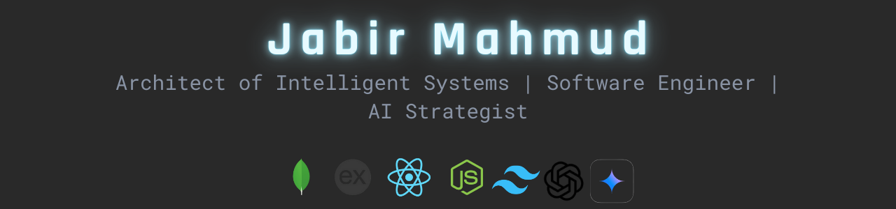

# 👾 Jabir Mahmud — Architect of Intelligent Systems

**Software Engineer | AI Systems Designer | Strategic Problem Solver**  
Engineering high-performance applications, AI assistants, and scalable infrastructures focused on precision and intelligent automation.

---

## 📌 Banner

## 🚀 Featured Projects

### 🔹 TechHive — AI-Powered Electronics E-Commerce Platform *(In Development, 2025)*

* Pure JavaScript (JSX) MERN architecture
* AI-driven via Gemini 2.5 Flash
* Smart chatbot, recommendation engine, dynamic content

### 🔹 CureBay — Healthcare E-Commerce Platform *(2024–2025)*

* Medicines, diagnostics, and teleconsultation
* Role-based dashboards (Patient / Doctor / Admin)
* Stripe payments, prescription verification

### 🔹 AI Career Platform *(2024–2025)*

* AI roadmap generation using Gemini 2.5 Flash
* Real-time trend analysis and skill gap detection

## 🛠 Core Technologies

| Category       | Tools                               |
| -------------- | ----------------------------------- |
| Frontend       | React, JSX, Next.js, Vite, Tailwind |
| Backend        | Node.js, Express.js, FastAPI        |
| AI & NLP       | Gemini 2.0 & 2.5 Flash              |
| Database       | MongoDB, PostgreSQL                 |
| Authentication | Firebase Auth, JWT                  |
| Payments       | Stripe                              |
| Desktop/Mobile | Electron, React Native              |
| DevOps         | Git, Docker, Vercel, GitHub Actions |

## 🧠 Technical Strengths

* Full-stack e-commerce development (MERN)
* AI chatbot & recommendation systems
* Modular and scalable architecture
* REST API design and optimization
* System automation and performance tuning
* Strategic problem solving

## 🚧 Current Focus

| Project         | Focus                                                |
| --------------- | ---------------------------------------------------- |
| TechHive        | AI chatbot, product intelligence, Stripe integration |
| CureBay         | Platform scaling, consultation upgrade               |
| Career Platform | Enhanced AI guidance, market analytics               |
| Portfolio       | Vercel custom domain deployment                      |

## 💡 Engineering Philosophy

> *"Code and curse. Break all limits. Master the system before it masters you."*

* Intelligence engineered at architecture level
* Scalable by design
* Precision over decoration
* Structured experimentation
* Full-stack ownership

## 🎓 Education

**B.Sc. in Software Engineering**  
*Expected Graduation: December 2025*

## 🤝 Collaboration & Consulting

Available for:

* Full-stack MERN development
* AI integration & system intelligence
* Technical consulting
* Code reviews and system architecture
* Freelance projects

## 📬 Contact

| Field        | Info                                                  |
| ------------ | ----------------------------------------------------- |
| 📍 Location  | Dhaka, Bangladesh (GMT+6)                             |
| 👤 Name      | **Jabir Mahmud**                                      |
| 🌐 Portfolio | [jabirmahmud.vercel.app](https://jabirmahmud.vercel.app) |
| 🔗 LinkedIn  | [linkedin.com/in/jabirmahmud0](https://www.linkedin.com/in/jabirmahmud0/) |
| 📧 Email     | jaabirmahmud01@gmail.com                              |
| 🐙 GitHub    | You're already here                                   |

### ⭐ If my work aligns with your vision, star the repositories and connect.

**— Building the future, one intelligent system at a time.**
